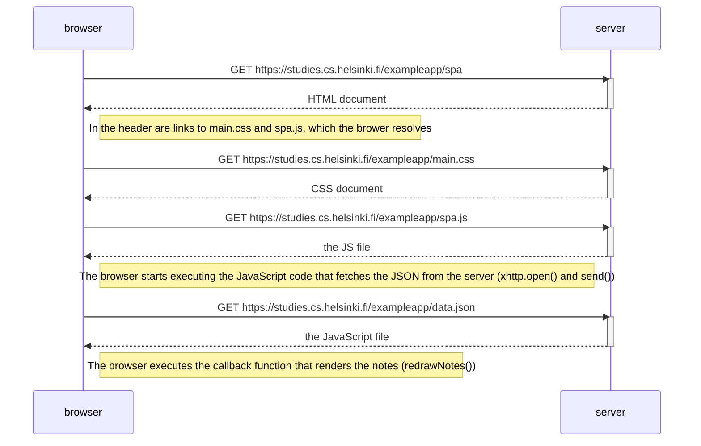

```mermaid
sequenceDiagram
    participant browser
    participant server

    browser->>server: GET https://studies.cs.helsinki.fi/exampleapp/spa 
    activate server
    server-->>browser: HTML document
    deactivate server

    Note right of browser: In the header are links to main.css and spa.js, which the brower resolves

    browser->>server: GET https://studies.cs.helsinki.fi/exampleapp/main.css
    activate server
    server-->>browser: CSS document
    deactivate server

    browser->>server: GET https://studies.cs.helsinki.fi/exampleapp/spa.js
    activate server
    server-->>browser: the JS file
    deactivate server

    Note right of browser: The browser starts executing the JavaScript code that fetches the JSON from the server (xhttp.open() and send())

    browser->>server: GET https://studies.cs.helsinki.fi/exampleapp/data.json
    activate server
    server-->>browser: the JavaScript file
    deactivate server

    Note right of browser: The browser executes the callback function that renders the notes (redrawNotes())
```
