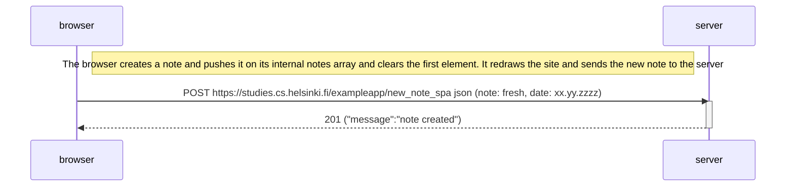

```mermaid
sequenceDiagram
    participant browser
    participant server

    Note right of browser: The browser creates a note and pushes it on its internal notes array and clears the first element. It redraws the site and sends the new note to the server

    browser->>server: POST https://studies.cs.helsinki.fi/exampleapp/new_note_spa json (note: fresh, date: xx.yy.zzzz)
    activate server
    server-->>browser: 201 ("message":"note created")
    deactivate server
```
